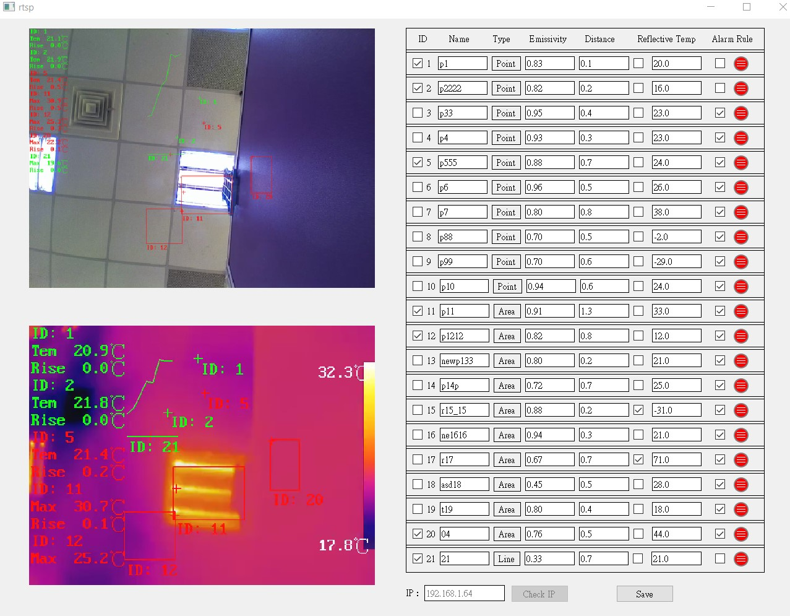

# desktop-app
In the "rtsp1" image, it includes real-time streaming protocol (RTSP) optical video and thermal video from the camera, with 10 points, 10 areas, and 1 line parameter setting.

In the "rtsp2" image, there is an alarm rule setting window for each set of 10 points, 10 areas, and 1 line.

In the "rtsp3" image, it includes OpenCV for creating 10 points, 10 areas, and 1 line temperature detection.

The source code will only be provided if requested by the interviewer.

## app

